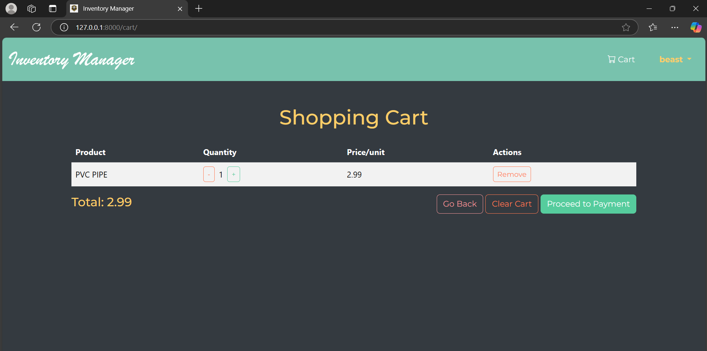

# 🛒 Inventory Management System

A full-featured **Inventory Management System** built with **Django, Bootstrap, and JavaScript**. This system allows users to **add, edit, delete, and manage inventory items**, **track quantities**, **search items**, **export data**, and **process payments** with UPI integration.



---

## 📌 **Features**
### 🔹 **Inventory Management**
- Add new inventory items with **category, name, quantity, and price**.
- Edit and update existing items.
- Delete items from inventory.
- Search for items by name, quantity, or category.

### 🔹 **User Authentication**
- Secure login and registration system.
- Separate user roles for **admin and staff**.

### 🔹 **Cart & Checkout**
- **Add items to cart** from the inventory.
- Increase/decrease item quantity in the cart.
- Remove items or clear the entire cart.
- **Proceed to payment** with UPI QR code generation.

### 🔹 **Payment & Order Processing**
- Generate **UPI QR code** for total cart amount.
- Save order details including:
  - **Transaction ID**
  - **Total amount paid**
  - **User details**
  - **Purchased items**
  - **Date & Time of Transaction**

### 🔹 **Other Features**
- **Export Inventory Data** as CSV.
- **Low Stock Alerts** for items below the threshold.
- **Pagination** for large inventories.
- **Dark Mode Support** (toggle in the navbar).
- **Bootstrap-powered responsive UI**.

---

## 🛠 **Technologies Used**
- **Backend:** Django, Django ORM
- **Frontend:** HTML, CSS, Bootstrap 5, JavaScript
- **Database:** SQLite (Default) / MySQL (Optional)
- **Authentication:** Django's built-in authentication
- **Payment:** UPI QR Code (Dynamic)

---

## 🚀 **Installation & Setup**
### 1️⃣ Clone the Repository
```bash
git clone https://github.com/biswojitpalai/inventory-management.git
cd inventory-management
```
### Create a Virtual Environment & Activate It
```bash
python -m venv env
source env/bin/activate  # On macOS/Linux
env\Scripts\activate      # On Windows
```
### Install Dependencies
```bash
pip install -r requirements.txt
```
### Apply Migrations & Run Server
```bash
python manage.py migrate
python manage.py runserver
```

## 🔑 **User Guide**
### 🌟 Adding Items
- Log in to your account.
- Click "Add Item".
- Fill in the item name, category, quantity, and price.
- Click "Add Item" to save.
### 🛒 Managing Cart
- Click "Add to Cart" on an item in the inventory.
- Modify quantity using + / - buttons.
- Click "Proceed to Payment".
### 💳 Making a Payment
- A UPI QR Code will be displayed for the total cart amount.
- Scan using any UPI app to complete payment.
- Click "OK" to confirm and save the transaction.
### 📦 Exporting Inventory
--> Click "Export CSV" to download inventory details.


